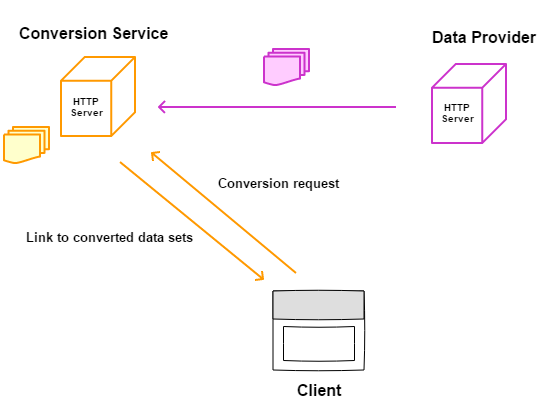

openLCA conversion service
==========================
This project provides a web-service for converting LCA process data sets. It is
a Java application using the [Grizzly HTTP Server](https://javaee.github.io/grizzly/)
and the import and export functions of the
[openLCA core modules](https://github.com/GreenDelta/olca-modules). For caching
data sets, it can be configured to use an 
[embedded Derby database](https://db.apache.org/derby/papers/DerbyTut/embedded_intro.html)
or a MySQL database.

### Implementation status

* [x] EcoSpold 1 -> JSON LD
* [x] EcoSpold 1 -> ILCD
* [ ] ILCD -> EcoSpold 1
* [x] ILCD -> JSON LD
* [ ] JSON LD -> EcoSpold 1
* [ ] JSON LD -> ILCD

## Installation
...

## How it works
A client sends a conversion request to the conversion server which includes an
URL to the respective process data set, the format of this data set, and the
target format to which this data set should be converted. The conversion server
then fetches all the required data from the data server using a format specific
protocol. The converted data set with all associated resources (e.g. flow data
sets etc.) are cached on the conversion server and a link to this data set is
send back to the client:

Note that the client could be itself the back-end of an HTTP server that sends
back the link to another client. The following data provider are currently
supported:

| Format | Data provider | Example URL |
|--------| -------------|------------ |
| EcoSpold 1 | Plain HTTP server providing the data set | [example from the Needs project](http://www.needs-project.org/needswebdb/scripts/download.php?fileid=4&type=xml) |
| ILCD | [soda4LCA](https://bitbucket.org/okusche/soda4lca) | [example from the ELCD database](http://eplca.jrc.ec.europa.eu/ELCD3/resource/processes/1a7da06d-e8b7-4ff1-920c-209e9009dbe0) |
| JSON LD | [openLCA CS](http://www.openlca.org/collaboration-server/) | ? |

## Building from source
...

the openLCA data conversion
functionalities. The service is linked to an openLCA Derby database for storing 
mappings, reference data, and processes. You can configure the service to use
an existing database. See the 
[sample configuration file](deploy/config.json) for more 
information regarding the server setup. In the distribution package, just 
execute the `run` script to start the service.  

Current API
-----------

	GET  database/processes
		
		Returns descriptors of the processes in the openLCA database.
		
		MIME type: JSON
		Example: http://localhost:8080/database/processes
		
		
	GET database/flows
	
		Same as database/processes but for flows.
		
	
	GET database/flowProperties
	
		Same as database/processes but for flow properties.
	
	
	GET database/unitGroups
	
		Same as database/processes but for unit groups.
		
	
	GET database/process/ecoSpold1?uuid=[process UUID]&mime=[MIME type]
	
		Returns the process with the given UUID as EcoSpold 01 formatted 
		data set. The mime-parameter is optional,. If mime=json, the result
		is returned as an JSON object, otherwise the XML data set is returned.
		Returning an JSON object allows to embed conversion logs and other 
		information.
		
		MIME type: 	XML (default) or JSON
		Example: http://localhost:8080/database/process/ecoSpold1?uuit=76d6aaa4-37e2-40b2-994c-03292b600074
		
		
	GET database/process/ecoSpold2?uuid=[process UUID]&mime=[MIME type]
	
		Same as database/process/ecoSpold1 but for EcoSpold 02.
		
		
	GET database/process/ilcd?uuid=[process UUID]&mime=[MIME type]
		
		Same as database/process/ecoSpold1 but for ILCD.
		
	
	GET soda/process?baseUrl=[URL of the soda service]&uuid=[process UUID]&format=[LCA data format]&mime=[MIME type]
	
		Pulls a process data set from an soda4LCA web-service, caches it in the
		internal openLCA database, and returns it in the given format. For the
		format parameter the following values are allowed: ecoSpold1, ecoSpold2, 
		or ilcd.
	
		Example: http://localhost:8080/soda/process?baseUrl=http://eplca.jrc.ec.europa.eu/ELCD3/resource&uuid=76d6aaa4-37e2-40b2-994c-03292b600074&format=ecoSpold2
	
License
-------
Unless stated otherwise, all source code of the openLCA project is licensed 
under the [Mozilla Public License, v. 2.0](http://www.mozilla.org/MPL/2.0/). 
Please see the LICENSE.txt file in the root directory of the source code.
    